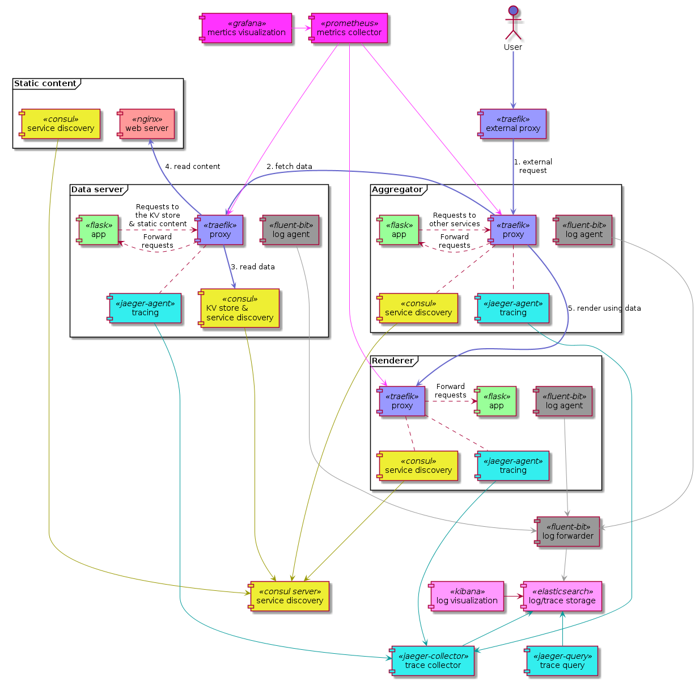

# Modernized stack

The example stack in this folder attempts to demonstrate how we can get some extra value for each of our *HTTP-y* applications by surrounding the with various services. Some of them will be placed in each of their *"pods"*, some will be centrally deployed in the stack. It includes a *DYI* service mesh with service discovery, log aggregation, metrics collection and distributed tracing.

- The `data-server` app returns some configuration and static config as JSON
- The `renderer` can render an HTML [Jinja2](http://jinja.pocoo.org/) template using data from this JSON
- The `aggregator` receives the incoming requests, then coordinates the data fetch and the HTML rendition with the other two

## Usage

The easiest way to try this is:

```shell
$ curl -fsSL https://raw.githubusercontent.com/rycus86/podlike/master/examples/modernized/install.sh | sh
```

You can also try the templated version, once you have the `podtemplate` script [installed](https://github.com/rycus86/podlike/tree/master/scripts):

```shell
$ git clone https://github.com/rycus86/podlike.git  \
    && cd podlike/examples/modernized               \
    && podtemplate deploy -c stack-templated.yml modern
```

> Pro tip: try this on the [Docker Playground](https://labs.play-with-docker.com/)

## Components

Each of the applications is coupled with:

- A [Traefik](https://traefik.io/) `proxy` for accepting incoming connections to the app, and to forward requests to other services from the app
- A [Consul](https://www.consul.io/) agent for service discovery, and to act as a [Key-Value store](https://www.consul.io/intro/getting-started/kv.html) for the `data-server`
- An *OpenTracing* compatible [Jaeger](https://www.jaegertracing.io/) agent for HTTP request tracing
- A [Fluent Bit](https://fluentbit.io/) agent to pick up logs from files on a shared volume and forward them to the central log aggregator *(see below the diagram)*



The stack also includes quite a few other services to make it *modern*:

- A frontend *Traefik* `router` as the main HTTP entrypoint to the cluster
- A central *Consul* server the local agents can connect to
- [Prometheus](https://prometheus.io/) with [Grafana](https://grafana.com/) for scraping and displaying metrics
- [Elasticsearch](https://www.elastic.co/products/elasticsearch) with [Kibana](https://www.elastic.co/products/kibana) for storing and visualizing the logs
- A central *Fluent Bit* to forward logs from the local agents to *Elasticsearch*
- A *Jaeger* collector and UI for distributed traces, also stored in *Elasticsearch*
- An extra *Jaeger* agent in the stack for the frontend `router` to report to
- An *Nginx* instance that serves the static bits for `data-server`
- One more local *Consul* agent running in the same network namespace as *Nginx* for service discovery

You can find the main application accessible on port `80`, the *Traefik* dashboard on `8080`, and you can have a look at the current state of services and the service discovery metadata on the *Consul* UI on port `8500`. You'll find *Kibana* on port `5601` to see the logs from the apps and their reverse proxies, the distributed traces on port `16686` on the *Jaeger* UI, and the metrics on port `3000` in *Grafana*. Everything should be preconfigured for this demo and ready to use, including an example *Grafana* dashboard, its datasource, and the default index pattern in *Kibana*. To have some metrics to look at, hit up `http://127.0.0.1/` a few times, or put some load on it with something like [wrk](https://github.com/wg/wrk).

> If you can't find the Grafana dashboard, go to [http://127.0.0.1:3000/d/_eX4mpl3/example-dashboard](http://127.0.0.1:3000/d/_eX4mpl3/example-dashboard) or similar on the Docker Playground
